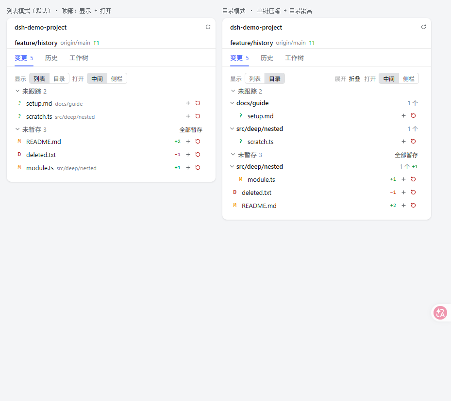
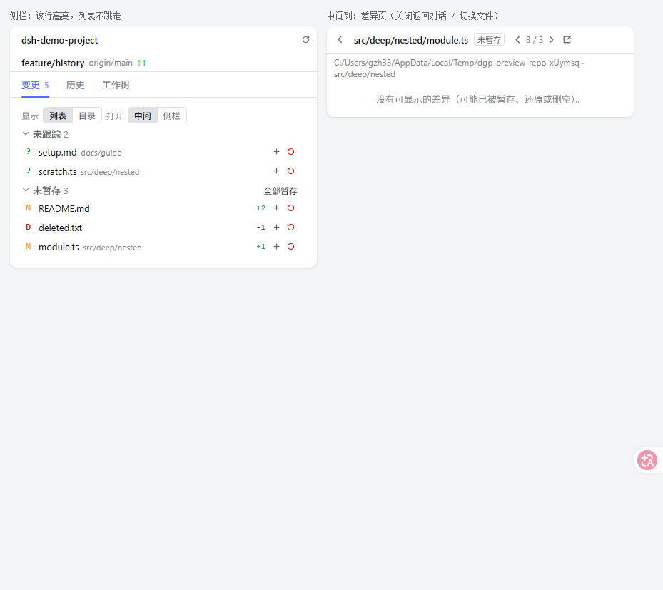
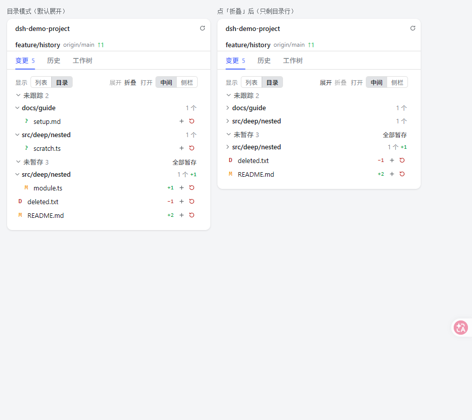
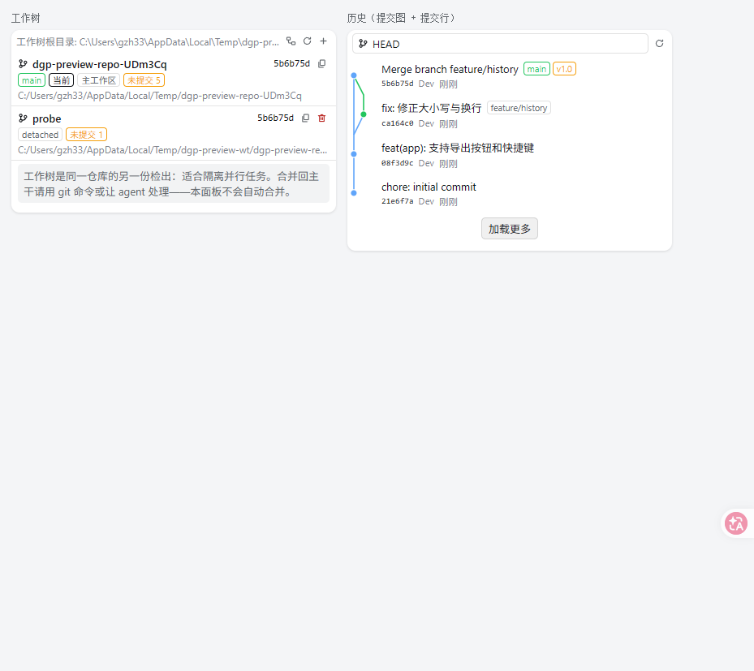
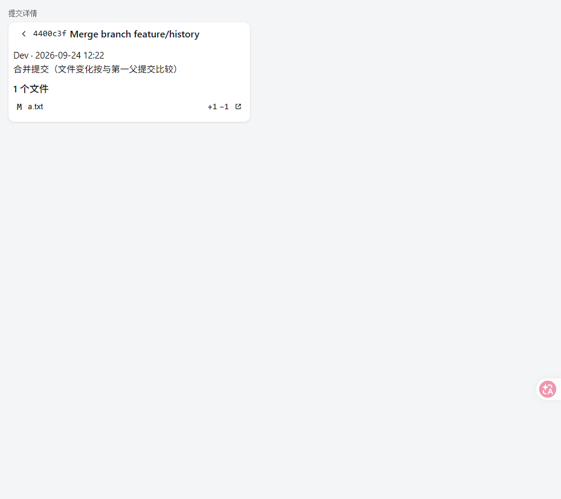
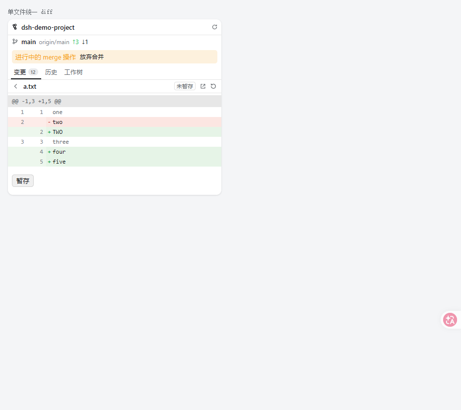

# dsh-git-panel

DSH Web 右侧栏的 **Git 面板**：在一个侧栏页里看当前待提交的变更与差异、浏览提交历史
（带提交图）、管理 `git worktree`。

对标两个参考实现的做法，并按 DSH 的插件模型重新落地：

- **Codex 桌面端**：Git 能力是「变更审阅 + 落地」，而不是完整 IDE。它给出
  `Unstaged / Staged / Commit / Branch / Last turn` 的视角切换、文件与 hunk 级
  stage/revert、以及「一个任务一棵 worktree、显式 hand off、不做隐式自动合并」的
  worktree 生命周期；官方明确把 log/blame/graph 留给用户的编辑器。
- **one-code 桌面端**（`apps/desktop/src/main/ipc/git.ts`、`lib/worktreeOps.ts`）：
  面板分「更改 / 历史 / 工作树」三个子页；变更按 index/worktree 两侧状态分组；
  worktree 默认 detached、先冻结基线为 SHA 再 `worktree add`、删除前必须知道 dirty
  状态，并且**脏且未强制时拒绝删除**。

本插件保留了这两条主线，同时明确砍掉了不安全的自动化（见「安全边界」）。

## 功能

### 变更

- 一次快照给出仓库事实（仓库根、分支、upstream、ahead/behind、进行中的
  merge/rebase/cherry-pick/revert/bisect）+ 全部变更条目。
- 分组：**冲突 / 已暂存 / 未跟踪 / 未暂存**；同一个文件可以同时出现在「已暂存」与
  「未暂存」两组里（git 的正常状态）。
- **两种显示模式**（面板顶部「显示」切换，选择记在 localStorage，刷新后保持）：
  - **列表**（默认）：一行一个文件，行内以弱化颜色显示目录前缀；
  - **目录**：按目录折叠成树，目录行聚合文件数与增删行数，**单链目录压缩成一行**
    （`src/deep/nested/x.txt` 只画一行 `src/deep/nested`）。每个目录行都有折叠箭头，
    工具栏右侧另有一对 **「展开 / 折叠」** 按钮一次作用于全部目录（折叠后只剩目录行，
    仍然带聚合信息；两个按钮会按当前状态互斥置灰）。折叠状态由面板集中持有，所以同一个
    目录在「已暂存」与「未暂存」两组里的开合保持一致，切换列表/目录、轮询刷新都不会丢。
  两种模式都**只改变画法**：分组、批量动作（全部暂存 / 全部取消）仍按暂存侧与工作区侧
  走，所以切模式不会改变任何语义。
- 每条变更带 `+n −m`（暂存侧与工作区侧各算各的）、状态字母 `M/A/D/R/C/T/U/?`。
- **点文件的差异有两个去处**（面板顶部「打开」切换，默认中间）：
  - **中间**（默认）：差异开在**中间列**，右侧栏列表原地不动、被点的行高亮；中间页左上角
    是返回箭头，点它即关闭并把中间列交还给对话（点左侧栏任意会话也会回到对话）；
    同批文件可用 `‹ 3 / 5 ›` 前后切换，另有「在内置预览中打开该文件」。
  - **侧栏**：保持原来的内联详情（返回箭头回到列表）。
  中间页不可用时（例如 `ctx.layout` 缺席）自动落回侧栏内联，不会出现点了没反应。
- 差异视图：统一 diff、双行号栏、增删配色、`\ No newline at end of file`、
  二进制提示、超大 diff 截断提示。
- 写操作：单文件/全部暂存、单文件/全部取消暂存、放弃未暂存改动、删除未跟踪文件、
  提交（可选 `amend`，需要二次点击确认）。全部走二次确认，且**没有**「提交并推送」
  这类把多步打包的动作。
- 未跟踪文件的差异用 `git diff --no-index -- /dev/null <path>` 现算，不需要先暂存。

### 历史

- 提交列表按 `--topo-order` 分页（默认 40 条，最多 200），带 `%D` 装饰
  （HEAD / 本地分支 / 远程分支 / tag）。
- **提交图**由 `src/shared/graph.js` 纯函数算泳道：active-lanes 模型，分页 append
  后整表重算，跨页车道不会断。
- 点提交看详情：作者、时间、正文、文件清单（与**第一父提交**比较，合并提交也是这个
  口径）、每个文件的增删行数；点文件就地展开该文件在该提交里的差异。
- 分支选择器：本地 / 远程 / tag 分组的搜索列表 + 「新建分支并切换」。
- 从差异页可一键切到「该文件的历史」（`git log -- <path>`）。

### 工作树

- 列出仓库全部 worktree：分支 / detached、HEAD、以及徽标——当前、主工作区、
  目录已不存在、已锁定、可清理、未提交 N、**状态未知**、已合并且干净。
- 新建：可指定名称、基线（当前 HEAD / 本地分支 / tag）、形态（**detached 默认** /
  新建分支）。基线在创建前先 `rev-parse --verify --end-of-options <ref>^{commit}`
  冻结成 SHA，避免 ref 在 resolve 与 add 之间移动。
- 删除：主工作区不可删 → 读不到 git 状态就拒绝 → 脏且未强制则拒绝 → 需要时先导出
  `git diff --binary --full-index <merge-base>` 补丁 → `worktree remove [--force]`
  → `worktree prune`；删除后分支**一律保留**，并在提示里说明。
- 清理失效登记（`worktree prune --verbose`）。
- 不做「自动合回主干」：那要先在工作树里自动提交、再在主仓库 merge，冲突时会把用户
  留在半完成状态。合并交给用户或 agent 在终端里做。

## 面板外观

| 列表模式（默认） / 目录模式（顶部：显示 + 打开） | 点文件 → 侧栏行高亮 + 中间列差异页 |
|---|---|
|  |  |

目录模式的「展开 / 折叠」（左：默认展开；中：全部折叠后只剩目录行；右：再展开恢复）：



历史（提交图 + 提交行）、工作树页，以及点开某个提交后的详情：





侧栏内联详情（「打开 = 侧栏」时的形态）：



> 上图由 `pnpm run preview` 生成：临时建一个真实仓库（冲突 / 已暂存 / 未跟踪 / 未暂存四组齐全），
> 数据经宿主侧解析后用 esbuild + SSR + jsdom 渲染成 HTML，配色取 DSH 主题变量。
> **外层 chrome 不是真实界面**（标签条、面板宽度、窗口标题栏由 DSH 自己画），
> 真实观感请在重启后的侧栏里核对。

### 与宿主面板对齐（像素级）

面板骨架照宿主内建「文件」页（`dsh-client-ui-sidebar-files`）的尺寸来，**文字列必须重合**：

| 位置 | 宿主「文件」页 | 本插件 |
|---|---|---|
| 头部文字 | `left = 528`（面板内边距 16px） | 仓库名 / 分支名同为 528 |
| 列表行首图标 | `left = 530` | 变更状态字母同为 530 |
| 列表行文件名 | `left = 552` | 文件名同为 552 |
| 头部高 / 分隔线 | `38px` / `.5px solid border-l3` | 相同 |
| 面板内页签 | 13px/500、`label-tertiary` → `state-business-primary`、2px 下划线 | 相同 |

两个关键陷阱都踩过：

1. **头部不要放前置图标**。图标本身在 528，但会把文字推到 547——和「文件」页的路径文字差
   19px，肉眼一眼就看出来没对齐。分支行同理。
2. **状态字母要占满 16px**（宿主列表的图标位宽度），否则文件名落在 548 而不是 552。

`dsh-run-env-manager` 也按同一份尺寸改过（头部 38px + 工作区名 + 刷新、页签同款下划线、
正文左内边距 16px），所以三个页签并排是齐的。

### 提交图的几何约束

提交图最容易「看着还行、其实断了」，所以三条约束都进了 `validate.mjs`：

1. `HistoryView.tsx` 的 `ROW_HEIGHT` 必须等于 CSS `.dgp-commititem` 的 `min-height`；
2. 泳道线段按 `ROW_HEIGHT` 画进 viewBox，再用 `preserveAspectRatio="none"` 纵向拉伸到行高
   （`vector-effect="non-scaling-stroke"` 保证线不被拉粗），因此某一行被内容撑高也不会断线；
   圆点是 HTML 元素而不是 `<circle>`——纵向拉伸会把 circle 压成椭圆；
3. **行上不能有纵向内边距**（否则提交图铺不满整行，相邻行之间露出断口），纵向留白放在
   `.dgp-commitinfo` 上。

当前行高 46px；每行两条（主题 + refs 徽标同行，下面一行是 hash / 作者 / 时间），行距均匀。

### 关于样式的一个坑（已加回归断言）

`.dgp-commit` 这个类名一度同时用在「变更页的提交框」和「历史页的提交行」上：提交框是
`flex-direction: column` + 边框 + 外边距，提交行是 `align-items: center`，两者叠加后
**历史列表每一行都变成居中且带边框的卡片**。这类问题在没有浏览器的单测里看不出来，所以
`scripts/validate.mjs` 现在会检查「同一个类是否被定义成两套规则」，并且 `tests/render.test.js`
会真正渲染**有数据的**历史页与工作树页（而不只是空壳）。

## 安装

在**本仓库根目录**执行：

```bash
dsh plugin --profile web add ./dsh-git-panel
```

然后**重启 DSH Web Host 一次**（profile bundle 在启动时装载），再刷新浏览器页面。

### 使用入口

- 右侧栏「+」→ 引导页里的 **Git 变更** 卡片；或直接打开 `git` 类型的页。
- 面板顶部：仓库名（`title` 是仓库根绝对路径）、分支、`↑ahead ↓behind`、刷新。
- 三个子页：**变更 / 历史 / 工作树**。

## 配置

配置项落在 Loader 条目（`$DSH_HOME/profiles/<profile>/cordis.patch.yml` 的
`git-panel` 行），可在「设置 → 插件」里改。全部字段都是 `volatile`——非 volatile
的写入会让 Loader 把整个插件卸载重挂。

| 字段 | 默认 | 说明 |
|---|---|---|
| `gitPath` | `''` | 留空则用 PATH，并在 Windows 上探测 `%ProgramFiles%\Git\cmd\git.exe`、`%LOCALAPPDATA%\Programs\Git\...` 等常规位置（GUI 进程的 PATH 经常没有 Git）。 |
| `worktreeRoot` | `''` | 留空用 `<仓库父目录>/.dsh-worktrees/<仓库名>/`。设置后为 `<worktreeRoot>/<仓库名>/`。 |
| `worktreeBranchPrefix` | `dsh` | 「新建分支」形态自动命名时的前缀，自动补 `/`。 |
| `diffContext` | `3` | diff 上下文行数（0~50）。 |

## 工作方式

```
浏览器（右侧栏 tab：git 类型）
   │  GET  /dsh-git/snapshot|history|commit|diff|branches|worktrees
   │  POST /dsh-git/stage|unstage|discard|commit|checkout|worktree*
   ▼
宿主（src/host/*）：spawn git（argv 数组、不走 shell）→ 解析 → JSON
```

- **每个写动作都回全量快照**（与 `dsh-run-env-manager` 同一套约定）：客户端不做增量
  推导，动作后用响应里的快照整体替换，三个子页永远看到同一份仓库事实。面板可见时每
  5 秒轮询一次（后台会话暂停）。
- 所有 git 调用都带 `--no-optional-locks`：agent 可能正在同一工作区跑回合，普通
  `git status` 会去刷新 index，撞上 `index.lock` 就整条失败。
- 所有路径都经 `--literal-pathspecs` 与 `--` 传入：形如 `a[1].txt` 的文件名不会被
  当成 glob。
- 子进程环境固定 `GIT_TERMINAL_PROMPT=0`、`GIT_PAGER=cat`、`GIT_EDITOR=true`：
  绝不弹交互提示、绝不打开编辑器或分页器。

### HTTP 接口

| 方法 | 路径 | 说明 |
|---|---|---|
| GET | `/dsh-git/snapshot?root=` | 仓库事实 + 变更 + 计数 |
| GET | `/dsh-git/diff?root=&path=&orig=&staged=1&untracked=1&context=` | 单文件差异 |
| GET | `/dsh-git/history?root=&limit=&skip=&ref=&path=` | 提交分页 |
| GET | `/dsh-git/commit?root=&hash=&path=&orig=` | 提交详情（可选带某文件差异） |
| GET | `/dsh-git/branches?root=` | 本地 / 远程 / tag |
| GET | `/dsh-git/worktrees?root=` | worktree 列表与建议根目录 |
| POST | `/dsh-git/stage` `/stageAll` `/unstage` `/unstageAll` `/discard` `/commit` `/checkout` `/abortMerge` | 写操作 |
| POST | `/dsh-git/worktreeAdd` `/worktreeRemove` `/worktreePrune` | worktree 写操作 |

## 安全边界

- **只在本机绑定时注册**：`ctx.webServer.host !== '127.0.0.1'` 时整组接口不注册。
- **写操作要求同源浏览器请求**：回环来源 + 回环 Host + `Origin` 必须存在且等于
  `http://<Host>` + 拒绝 `sec-fetch-site: cross-site`。
- **完全不做联网**：不提供 fetch / pull / push / clone / remote / submodule 任何一项，
  因此插件不接触凭据、不产生网络流量（`scripts/validate.mjs` 把这条写成回归断言）。
- **参数是语义护栏**：`root` 必须绝对路径；ref 限 `[A-Za-z0-9._/\-@^{}~]+` 且不得以
  `-` 开头（防 `--upload-pack=…` 这类参数注入）；hash 限十六进制；仓库相对路径拒绝
  绝对路径、盘符、`..`、NUL 与换行；一次批量操作最多 500 条路径。
- **破坏性操作必须显式**：放弃改动、删除未跟踪文件、强制删除 worktree、`amend` 提交
  都需要二次确认；`commit` 只提交 index，**不隐式暂存任何东西**。
- **切换分支要求工作区干净**，且没有进行中的 merge/rebase 等操作。
- 输出的路径与行数都有上限（单文件 diff 4 MiB、一次最多渲染 3000 行、一次最多
  2000 条变更、工作树状态最多探测 50 棵），超过就截断并明确提示。

## 与参考实现的差异（有意为之）

| 事项 | 参考实现 | 本插件 | 原因 |
|---|---|---|---|
| status 解析 | porcelain v1（简单解析） | `--porcelain=v2 -z` | 重命名/复制/未合并状态与含空格、含非 ASCII 的路径都能正确处理 |
| hunk 级 stage | Codex 有 | 无 | 需要 `add -p` 的交互协议；侧栏里做不划算 |
| 自动合回主干 | one-code 有（自动提交后 merge） | 不做 | 会把用户留在半完成状态，交给终端 |
| 差异打开位置 | one-code 有「中心编辑器 / 弹窗编辑器」设置 | 中间列 / 侧栏内联，可切换 | 复用 DSH 自己的中心 `main` 席位，不另造窗口 |
| 提交并推送 / pull / push | Codex、one-code 都有 | 不做 | 联网与凭据都在插件边界之外 |
| AI 生成提交信息 | one-code 有 | 暂未做 | 复用 DSH 会话即可实现，留作后续 |
| rebase 进行中状态 | one-code 未检测 | 检测并在 UI 提示 | `rebase-merge`/`rebase-apply` 标记文件即可 |

## 已知限制

- **只读 git 的本地状态**：不 fetch，所以 `ahead/behind` 是**上次 fetch 之后**的
  相对关系，不代表远端当前状态。
- **一个工作区一棵仓库**：工作区是仓库子目录时会显示整个仓库的变更（git 的语义），
  顶部以仓库根提示。
- **历史分页的提交图**：每页按累积列表重算泳道，第一页之前的历史不参与布局，所以
  第一页的泳道起点是「当时的活动列」。
- **不做 hunk 级操作**：只有文件级 stage/unstage/discard。
- **二进制文件只提示不渲染**：不做图片预览或十六进制视图。
- **子模块只按 git 的报告显示**，不递归进子模块仓库。
- **`checkout` 不带 `--force`**：宁可拒绝，也不覆盖用户未提交的工作。
- **右栏宽度刷新后回默认——这是宿主行为，不是本插件**：栏宽归 `dsh-client-ui-layout`，
  它的状态在一个纯内存 store 里（该包 README：「布局状态在刷新后重置」），公开的
  `ctx.layout` 只有 `selectPanel / toggleSidebar / openRightbar / closeRightbar`，
  **没有 setter**，所以插件既读不到也写不到宽度。右栏**内部**的标签布局倒是持久化的
  （`dsh-client-ui-sidebar-right` 存在 `dsh.sidebar-right.v1.<sessionId>`），
  所以刷新后「标签还在、宽度没了」。要改只能动 DSH 自己。

## 开发与验证

```bash
cd dsh-git-panel
pnpm install --ignore-scripts
pnpm run build      # esbuild 打包 src/client → lib/client.js
pnpm test           # 纯解析 / 泳道 / 契约 / 真实 git 集成 / HTTP 接口
pnpm run validate   # 脚手架约定 + i18n key 完整性回归断言
```

测试覆盖（共 8 个文件、380 条断言；没有 git 时集成用例自动 SKIP）：

- `tests/parse.test.js`：porcelain v2 `-z`、`--numstat -z` 的 rename 怪形态、
  `diff-tree --name-status -z`、log 记录、worktree porcelain、for-each-ref、统一 diff
  （段落/行号/无换行标记/二进制/改名）。
- `tests/graph.test.js`：线性、分叉、合并、多根共享父、泳道钳制、append 重算。
- `tests/contract.test.js`：路径/ref/hash/分支护栏、worktree 目录推导、变更分组。
- `tests/tree.test.js`：目录树的排序（目录在前、自然序）、单链压缩、目录行聚合
  （文件数与两侧行数）、未跟踪的「未知行数」、`collectDirectoryPaths`（全部折叠的
  目标路径）、Unicode 与空路径边界。
- `tests/client.bundle.test.js`：**直接执行 `lib/client.js`**，模拟 DSH 的
  `__ModuleLoader__` 与假 ctx（含 `layout` / `sidebarRight` 服务），断言 tab 类型、
  正文席位、中心 `main` 席位（key `git-diff`）、`selectPanel('git-diff')` / `selectPanel(null)`
  的接线、文件预览地址、样式注入与文案解析都正确。
- `tests/render.test.js`：用 esbuild 把视图组件打成 Node bundle，先做服务端渲染
  （真实仓库数据 → HTML），再在 **jsdom** 里真挂载 `GitPanel` / `DiffPage` 并按顺序点击：
  列表 ⇄ 目录、目录模式下的「展开 / 折叠」、点文件（中间 / 侧栏 两条路）、
  中心页 `‹ ›` 切换与关闭、打开内置预览、暂存、返回、全部取消；另外挂载**有数据的**
  历史页（提交行 / 提交图 / refs 装饰 / 加载更多 / 点开详情 / 分支选择器）与工作树页
  （当前·主·未提交·detached 徽标）；断言两种显示模式的 DOM 差异、偏好持久化、折叠后
  嵌套文件消失而根级文件保留、展开后恢复、中心接管后侧栏不再拉 diff 且行高亮、
  动作调用与页面内容。
- `tests/git.integration.test.js`：真实临时仓库上的状态→差异→暂存→提交→历史→分支
  →worktree 全链路（含「脏且未强制拒绝删除」「导出补丁后强制删除」）。
- `tests/routes.test.js`：用假的 `webServer`/`req`/`res` 打真实 handler，覆盖同源
  门禁、未知接口、方法限制、写动作后快照、非回环绑定时不注册。

### 已验证的端到端形态

开发时用一个**独立的 DSH_HOME + 独立 profile（端口 3099）**跑过一次真机验证，
确认（验证用的实例与临时目录已全部删除，未触碰正在运行的 DSH Web）：

- 宿主条目 `git-panel` 能被 Loader 正常装载（`dsh --profile web --dump-config` 可见）；
- `/dsh-git/snapshot` 在真实 DSH 主机上经认证后返回本仓库的正确状态
  （分支、upstream、未跟踪文件列表）；
- 客户端 bundle 出现在 boot 载荷里（`plugins/??dsh-git-panel/client.js&rev=…`）
  且可被主机正常服务（200）；
- 写操作经真实 HTTP 栈验证：缺 `Origin` 返回 403，带同源 `Origin` 的
  `stageAll` / `commit` / `worktreeAdd` 均成功并真正改动了临时仓库。

**视觉验证**：在独立 DSH 实例（独立 `DSH_HOME` + 独立 profile，插件同样用 `dsh plugin add`
装入）里开好「文件 / Git / 运行」三个页签，用浏览器 `getBoundingClientRect()` 逐个量左边距，
再逐屏截图核对；上表的 528 / 530 / 552 就是这么量出来的。量完的实例、浏览器会话与临时目录
全部清理，不影响正在运行的宿主。

## License

MIT
